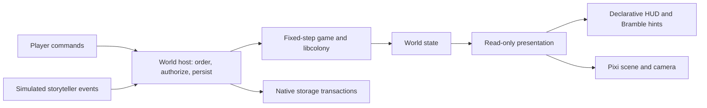

# Goblin Bed & Breakfast: parties, homes and a larger world

Architecture proposal, 2026-09-07. Starting playable revision:
`cb80c55fe9932c2e01c7570ed855266d03cb9695`.

This document plans the next implementation and records focused runtime evidence.
Levi has now opened the full-viewport, two-person polish goal described below.
It does not claim implementation of multiplayer, streaming, upper floors or a backend.
The accepted game and character study remain the regression baseline.

## The experience we are building toward

A player develops a persistent witchy homeland with roughly five controlled
people, divided into working and traveling parties. Another player can arrive
with their own caravan, possessions, learned spells and history. The visited
world remains a place with its own buildings, supplies and permissions.
Characters retain their identities when traveling; visiting does not clone them.

Working assumption: homelands have separately identified world spaces connected
by travel. A continuously shared geography is not required for the first visit.
Within a homeland, terrain can expand through chunk generation and loading.
Five people is the initial player-roster target, not a hard limit on all entities
or a fixed-size data representation.

Levi also requests a readable Rowan name label, Bramble guiding early play, and
an early demonstration of constructing and using a second-floor bedroom.
Those belong in the first implementation sequence below.

## One simulation owner, several kinds of data

Keep the existing synchronous fixed-step simulation. Player commands, later
AI commands and storyteller events are inputs; the simulation owns outcomes.
The browser displays its state. A future server uses the same domain code.



The host and simulation are parts of one authority, not independent state
writers. Persistence and transport do not reimplement job settlement.

| Concept | Owns | Does not own |
| --- | --- | --- |
| World authority | Sole active writer for all actors, parties, jobs, claims and material in this world, regardless of chunk residency; its tick and admitted commands | A person's permanent player identity |
| Actor record | Stable ID, position, activity, needs and carried material | Another copy of party membership |
| Party record | Member IDs, scoped orders and travel intent | Copies of its people or their inventories |
| Job record | Kind, party/actor scope and stable target reference | A second mutable copy of order or activity status |
| Terrain chunk | Terrain and local object records in a spatial region | A separate game clock or automatic server boundary |
| Resource claim | A promise against available stock/destination capacity | Additional physical material |
| Renderer | Sprites, camera, selection, visibility | Work progress, inventory or elapsed game time |

Record rows describe field ownership under that one writer, not separate
services. Loading a chunk never gives it authority over a person.
Use typed ID records/maps for actors, parties, jobs and target lookup; keep
explicit ordered job IDs for priority. Chunk membership and occupancy indexes
are derived references. Do not store the same actor in two mutable records.
Introduce unique item instances when equipment needs individual identity; learned
spells can reference stable definitions and actor-owned learning progress without
becoming transferable item instances. Current wood can remain a typed quantity
with one location.

This is enough data orientation for these slices. A generic ECS, job language,
plugin registry or event-sourcing engine has no demonstrated consumer yet.

## Parties and composable work

Commands capture their party and selected actor scope. A person can work only
on authorized jobs for their current party and command scope. Reprioritization
changes waiting order; it does not silently interrupt a current haul. Explicit
cancellation and departure use the same activity cleanup/material rules.

Keep persistent orders separate from their currently executable activity.
Construction derives hauling and work from the site's real remaining material
and work. A later workstation should reuse these operations, adding its recipe
and domain outcome rather than copying movement, pickup, cancellation and UI.

One scheduler pass offers eligible actor/job edges to the real pinned
`Module.optimize`. Use a shared task ID for an exclusive job across actors and
exactly one edge per actor/job pair. Deterministically select one feasible
source/path payload per pair before emission and keep that payload in a lookup
keyed by the pair; do not encode its alternatives as duplicate edges. Never call
the optimizer independently for each person and then
pretend it coordinated their assignments.

Player priority constrains eligibility before matching. Specify and test the
small admission policy with examples: one worker retains first-ready behavior;
several workers may fill several ready orders; an explicit actor assignment is
respected; a waiting order does not stall unrelated ready work. Avoid introducing
a second optimizer to encode those rules.

Commit returned assignments in a stable order, rechecking and claiming scarce
source stock, destination capacity and exclusive work before travel begins.
An assignment that cannot claim its resources waits for a later tick.
libcolony matches people and tasks; it does not know two tasks want the same log.

Claims do not add to material totals:

```text
physical piles + actor cargo + material held by sites = produced - consumed
available pile quantity = physical pile quantity - outstanding pickup claims
```

Pickup transfers material from pile to actor and releases its source claim;
the destination obligation remains until delivery/cancellation. Delivery moves
the material into the site. A cancellation must preserve recoverable material,
including the reviewed roof-over-wall case. Account for finished construction
either as retained material or consumed material, consistently, never both.

For the first caravan, admit departure only after local work is finished or
explicitly canceled. Pre-pickup cancellation deletes a claim without changing
the pile's physical quantity. Post-pickup cancellation returns committed cargo
to a reachable origin pile and releases destination capacity; merely deleting
the claim cannot move wood. Then load selected caravan supplies through a real
hauling order. A later explicit reauthorization could allow already-carried
supplies to travel; do not silently convert cargo committed to someone else's work.
Keep body collision soft initially; competing stock/jobs already require claims,
but exclusive doorway occupancy needs its own actual gameplay requirement.

## Chunks, generation and the camera

Retain global integer `{x, z, level}` positions within a named world. Start with
16 by 16 horizontal chunk cells: the authored 15 by 15 home fits inside one,
and crossing its edge is easy to prove. This is a tunable storage/render choice,
not a limit on a room, journey or homeland. The ground art remains 32 by 16
native pixels per diamond; chunk size and sprite size are independent.

Use floor division for chunk lookup. With width 16, x=-1 belongs to chunk -1,
local x=15. Positions, generated IDs and ownership do not change when a chunk
loads or unloads. Generated IDs derive from stable world/feature locations;
dynamic IDs use a persisted world-owned allocator with a world namespace.

Separate three lifecycles:

- **Visible:** instantiate terrain and sprites for the camera plus overhang.
- **Resident:** keep decoded data needed by active actors, work, navigation and
  construction queries. Dirty data cannot be evicted before a successful save.
- **Simulating:** advance the people and work in active regions, even offscreen.
  Dormant unoccupied terrain requires storage, not continuous per-tile ticks.

Home work pins its necessary data. Moving the camera away can remove its render
objects, but must not stop its worker. Use a third unoccupied modified chunk to
prove actual data eviction; do not require eviction of a chunk still needed by
the person working at home.

Generate only absent base terrain, using world seed, generator version and
stable coordinate-based randomness. Neighbor request order must not affect the
result. Border sampling/feature ownership prevents seams and duplicated trees.
Start with original grass, oaks and rocks; a biome/world-history generator is
not needed. Saves override generated baselines and preserve removals/tombstones,
so revisiting cannot restore chopped trees or collected wood.

World queries distinguish known walkable, known blocked and missing data.
Pathfinding searches a bounded loaded corridor and returns a route segment,
needs-data, search-budget-exhausted or no-route-in-that-domain outcome.
Missing data is not a reason to drop carried wood or declare a job impossible.
A journey retains its destination while segments load. Initially reuse bounded
BFS; choose A*/hierarchical routing only against a measured larger journey.

Room and footprint queries also cross chunk boundaries. Pin a bounded complete
construction region and known exterior border; if its continuation is unknown,
report pending rather than treating a residency edge as outdoors. Cache these
derived results on relevant topology changes and share them with UI/jobs.

Decouple the movable view transform from the fixed art-bake camera. Projection,
picking, ghosts, paths, names and cutaway use the same camera origin and selected
level. Render near that origin rather than feeding very large coordinates into
graphics math. Preserve the existing art scale and pixel alignment.

The current cut-earth clearing image cannot repeat as terrain. Adapt the
original geometry into seamless ground tiles/patches; retain the home as authored
terrain. Keep depth-bearing props and people in shared visible sorting layers:
nesting each chunk's bodies in a container prevents sprites in different chunks
from interleaving correctly. Include offscreen roots with visible canopies.

## A real upper floor, early

Define `level` as an integer walkable storey for this cut, initially 0 and 1.
Use one shared art storey-height constant, calibrated against existing walls
(about 2.16 geometry units) and thatch (about 2.5). A geometry height passed to
the current projection is not already a logical floor number. Preserve the
approved ground-floor art while measuring the first upper-floor cutaway.

Add material-built **floor** and **stair** definitions. Roof provides cover;
floor provides a supported walking surface and cover below, subject to an
explicit stair opening. Surface, standing-object and overhead occupancy must
replace the current roof-versus-everything overlap shortcut.

Use one modest supported upper platform over a finished lower enclosure; reject
unsupported extensions. This is a declared construction rule, not a structural
physics solver. Floors/stairs need legal lower construction positions so the
first landing can be built before it is reachable from above. Ordinary upstairs
furniture requires upstairs work positions. Current x/z-only work adjacency
must include storey and the actual allowed construction position.

A finished stair adds a directed pair of traversal edges between its lower
entrance and supported upper landing. Ordinary neighbors stay on one level.
Revalidate those edges/endpoints during travel; render continuous ascent without
changing logical positions to fractional cells. Selected-floor picking, visible
footprints and floor cutaway must make upper placement unambiguous.

Prove gathered wood becomes floor/stairs, then carried bed materials go up those
stairs, the bed is built upstairs, and an actor actually sleeps there. Its two
cells need support, enclosure and cover. Block the sole stair approach and prove
a later delivery/rest order cannot work or sleep through the floor. Shelter
and a particular actor's access are separate queries. General ramps, elevators,
terrain excavation and arbitrary structural collapse remain outside this proof.

## Readable UI and Bramble's introduction

The next goal makes the world fill the viewport. Remove the surrounding title,
sign, boxed workbench/footer and instruction strip; rehouse useful controls in
compact overlays. Keep time/fake-storyteller status at the edge, a roster for
selection, a build palette, a selected-character inspector and a target action
menu. Orders, rest and routines belong to their relevant actor/party context.
Use a small explicit set of windows and their focus/close behavior, not a generic
desktop environment. Overlay input must not also place a blueprint underneath.

The view camera may pan/zoom independently of the art-bake camera. Use one uniform
world-to-screen transform and its inverse for picking, ghosts and anchored labels;
do not stretch the fixed 640 by 400 art into a different aspect ratio. Names and
controls remain readable when the view changes. Ordinary play fills `100dvh`;
browser Fullscreen API remains optional and user-triggered.

Levi explicitly selects OpenTUI Keymap for hotkeys. The interim uses the pinned
`@opentui/keymap@0.5.10` HTML adapter, one binding definition and its active-binding
formatting for HUD hints. The retained Botanical browser integration was inspected
at `366dc8c1339cf5f5fbd07ffefc6eba8c8fa42c9d`; current Botanical-next has the accepted
physical/semantic ownership ADR, not a claimed already-integrated keymap caller.
Game actions remain local; no Whistle/runtime migration is part of this game.

The requested floor controls should distinguish active storey from cutaway/roof
visibility. Four quarter-turn views are the intended later rotation interface.
Rotating projection requires inverse picking, view-relative depth sorting and
matching directional bakes for props, joins and figures. It never mutates world
positions. The original Three geometry is the source for those extra views.

Click a person or roster portrait to inspect/select them. A target context menu
offers valid actions for that selection. Capture actor IDs when an order is
submitted, so later selection cannot retarget it. Distinguish an immediate direct
order from a queued order and shared construction designation. Interruption uses
the same physical-cargo/claim cleanup rules as cancellation; it cannot discard
wood or claim someone else's current work. Keep keyboard focus on stable controls
as the underlying activity changes. Touch must have an explicit route to those
same target actions rather than depending on a secondary mouse button.

One authored outsider is visibly present before recruitment. Inviting them
changes party membership of that existing actor, after the multi-person scheduler
and material ownership work. It must not create a copied pawn or parallel single-
person simulation. Two people prove the foundation used by the intended five;
the roster representation has no two-person hard limit.

First fix the reported ROWAN name label: legible lettering at native/intended
scale, contrasting backing or outline, stable positioning and a label overlay
that scenery cannot cover. Check the actual ground and upper-floor backgrounds,
desktop and narrow layout. Keep world labels small enough to preserve the art.

Require stable keyed DOM updates and a cached read-only HUD snapshot. React is
the preferred maintained declarative candidate: the first panel migration must
demonstrate deletion of whole-list `innerHTML` replacement, selector/property
wiring and manual reconciliation, without adding another world-state owner.
Judge that actual diff and bundle impact before expanding the migration. Stable
order IDs preserve focus. Pixi keeps its retained display objects and direct
animation updates; UI components do not own simulation ticks or resource state.

Bramble gives short contextual hints based on actual progress: select someone,
place an order, chop for a waiting blueprint, watch hauling, finish shelter and
use the bed; later explain the floor selector/stairs when relevant. Advance hints
on observed outcomes, not fixed delays. Allow dismissal/replay and avoid repeated
interruptions. This is deterministic presentation over existing facts, not an
LLM/chat integration, another job queue or a second tutorial simulation.

## Next-round art and inventory notes

Levi requests painterly animated grass/leaves. Start with a small original
Three-to-sprite wind study: grass clumps and leaf canopies have a few authored
wind poses, staggered phases and stable placement. Trunks can stay still while
canopies move. Keep pixel scale, depth, overhang and transparent sorting readable;
do not add a general foliage engine before the motion looks good in the game.

He also requests Diablo-style rotatable backpack packing, with hand-held work
cargo separate from that grid. Stable item instances eventually have exactly one
location: ground, backpack placement, equipment/hand slot, construction/work input,
or explicit consumed output. Rotation and footprint determine packing; mass is a
separate rule. World tile size does not determine inventory-grid size. Large logs
can occupy hauling capacity/arms without being compressed into backpack squares.
The current quantity-based wood transfers and future item movement share the same
conservation rule; claims promise transfers and never create a second item. This
direction does not require nested bags, equipment balance, ammo varieties or a
general container framework in the current two-person home.

Equipment should have a readable paper-doll panel with compatible drop targets:
head, body, hands and feet, plus worn storage such as a backpack and belt. A bag
provides its own storage layout rather than silently increasing a global integer.
Removing it must move the bag with its contents or explain why that move cannot
fit; never discard overflow. Gear definitions describe slots, footprints and
effects; particular items retain identity, material and condition. UI drag ghosts
are proposals until one simulation command transfers the item successfully.

Levi wants deep authored crafting, early leather processing followed by refined
methods, and knowledge exchanged through physical books. Research actual mod
mechanics before choosing a small first chain. A book, recipe knowledge and a
person's skill are distinct facts; copying, teaching and use should become
explicit work rather than a global unlock triggered by owning a book. These are
future product considerations, not a new crafting system in the controls release.

NullTale/LutLight2D is a requested lighting reference. Its Unity URP implementation
uses authored color ramps/LUTs and lighting intensity for palette replacement.
Explore that technique with the existing original baked sprites and a separate
world-light field; keep UI colors and simulation visibility independent of the
presentation shader. Spooky moonlight, emissive mushrooms and magical lanterns
should first be a small rendered night study.
[Upstream reference](https://github.com/NullTale/LutLight2D).

## Persistence and future multiplayer hosting

The first local persistence proof should use IndexedDB through the maintained
[idb API](https://github.com/jakearchibald/idb), with native transactions across
changed chunk records and the world/actor/job checkpoint. Prepare a coherent
snapshot before asynchronous writing; acknowledge its revision only after commit.
Do not serialize Pixi objects, caches or connections. Store schema/generator
versions and validate imported/stored representations with a maintained schema
decoder. Do not build a generic database abstraction or migration framework.

Keep the active simulation synchronous and typed. Effect is a candidate owner
for actual storage/network/cancellation lifecycles as those arrive; it does not
replace native transactions or become a real-time scheduler for walking and work.
Prefer one boundary schema owner when persistence/transport are implemented,
rather than independent shape parsers in every caller. Pin and prove adopted
dependencies in that implementation slice; this plan installs none.

For hosted multiplayer, start with **one homeland/site authority containing
multiple chunks and everyone currently interacting there**. Cloudflare recommends
coordinating at the logical unit whose state must agree. A terrain boundary is
not automatically a server migration. Large-world sharding remains a workload
decision, not a reason to distribute the first house across several DOs.
[Cloudflare design guidance](https://developers.cloudflare.com/durable-objects/best-practices/rules-of-durable-objects/#model-your-durable-objects-around-your-atom-of-coordination).

A SQLite-backed DO is the proposed first hosted authority. Its attached storage
can commit local state atomically; that transaction does not span another DO or
roll back a mutated JavaScript object. On a failed commit, discard/reload the
uncommitted candidate before continuing. Keep simulation transitions synchronous
and network/model awaits outside them.
[Storage API](https://developers.cloudflare.com/durable-objects/api/sqlite-storage-api/).

Clients submit intent for their authorized actors; the host orders/validates it
and publishes authoritative revisions. Use command identities to suppress
duplicate effects on reconnect, with bounded retention/checkpoints. Hibernating
WebSockets are the candidate multiplayer transport. Local UI selection is private;
shared speed/pause/reset belongs to the world's policy, not any visiting client.
First prove two clients in one authority before independently hosted homelands.
[WebSocket guidance](https://developers.cloudflare.com/durable-objects/best-practices/websockets/).

Permanent player ownership and current simulation authority are different.
When a wife visits her husband's world, her people/items/abilities retain their
IDs and ownership while the destination becomes their sole active writer.
Later cross-world handoff must survive retries and crashes without two active
copies or lost cargo. That needs a small durable transfer state machine proven
between two actual owners; it is not implemented by a same-world chunk crossing.
Do not invent its wire protocol before the two-site caller exists.

A guest initially controls their own people. Building, taking shared supplies,
trading or affecting residents needs explicit world permissions. Spell execution
uses host-validated ability state and game rules, not arbitrary client code.
Authentication, spell mechanics and those permissions are later implementation
slices, not features this architecture pass has delivered.

## Time while away, timers and AI

Store the last committed simulation tick and its wall-clock mapping. Online
worlds advance through the same fixed-step rules. On wake, process elapsed work
in bounded batches, saving progress and never moving the cursor past work that
was not performed. The current browser frame accumulator clamps long delays and
must not be reused as offline catch-up. Persist enough pending work to continue
after interruption. New commands must not be applied retroactively ahead of an
unprocessed backlog.

DO alarms request a wake; they are at-least-once delivery, not the simulation
clock or exactly-once outcomes. Ordinary recurring JS timers prevent hibernation.
A per-DO alarm may represent the next due meaningful activity while durable game
state records all pending work. Do not keep every wilderness tile ticking or
promise exact wall-clock callbacks.
[Alarms](https://developers.cloudflare.com/durable-objects/api/alarms/),
[lifecycle](https://developers.cloudflare.com/durable-objects/concepts/durable-object-lifecycle/).

Before optimizing an offline interval into deadline arithmetic, prove equivalence
to the fixed-step path for the affected work/needs/dependencies. Distant caravan
travel may eventually use a coarser explicit travel model; the first local proof
walks real cells and does not claim an equivalent offline macro model.

Optional paid automation can fund defined activity/AI decision budgets with
cancellation and expiry. Persistence, active simulation and model calls have
different costs. Pricing and entitlements are product work after measuring the
service; no payment or model integration belongs in the first local milestone.
AI actors issue the same authorized commands as humans. Shiitake remains the
future storyteller; its event delivery timing never owns movement or resources.

## Implementation sequence and evidence

| Slice | Observable result | Source responsibilities and decisive proof |
| --- | --- | --- |
| 1. Full-viewport two-person home | The world fills the window. Inspect Rowan, issue direct/queued contextual work, recruit an outsider and have both share supplies correctly. Names are readable and Bramble explains the loop. | First review the new surface/inspector and an actual chop outcome. Type `clearing/jobs/resources` and definitions, add actor/party IDs and claims, adapt `main/hud/view`. Two people/two orders/one scarce pile cannot duplicate material; cancellation refunds reachable wood; existing home/rest/pause/replay and keyboard-focus checks remain valid. |
| 2. Upper-floor bedroom | Build a modest loft, carry materials upstairs, build and use its bed. | Extend `world/movement/construction/art/home` and view together. Explicit stair edges/work positions, supported footprints, correct cutaway/picking, and blocked-stair negative case. Review intended-scale pixels before more vertical content. |
| 3. Local caravan and streamed terrain | One person leaves with earned cargo, crosses a chunk boundary and returns while the other keeps working at home. | Replace finite-grid/data/camera assumptions through `world/movement/construction/view/art/clearing/scale`. Keep home data pinned offscreen; save/evict/reload a third modified unoccupied chunk. Restart from a committed snapshot and preserve actors, cargo, jobs, stumps and construction. |
| 4. Same-world multiplayer host | Two clients control their own people against one authoritative world. | First resolve hosted optimizer memory/runtime fit. Then local DO storage/socket proof, duplicate commands, reconnect and eviction; remote deployment requires its own concrete authorized backend candidate. |
| 5. Homeland visits and background work | A caravan enters another persistent home; its identities and possessions survive departure/arrival and offline work. | Actual two-owner transfer recovery, permissions and bounded catch-up parity. Add spell demonstrations and paid AI only as separately bounded consumers of these foundations. |

These are coherent increments, not parallel writers for coupled game seams.
Astra owns the core implementation; bounded reviews inspect the actual first
source/rendered shape. UI presentation and later hosting research can proceed
independently where they do not depend on an unresolved model change.

## Later combat reference: one bow, real arrows

Levi proposes Combat Extended as a reference for eventual combat. Its current
Development source was inspected at
`c63c9656c0837371014b45519bfd6becfa0bc4ac`. It is a C#/Unity/RimWorld mod with
CC BY-NC-SA 4.0 licensing; it is a mechanics reference, not a dependency or a
source of shipped code/assets for this original game.
[Upstream source](https://github.com/CombatExtended-Continued/CombatExtended/tree/c63c9656c0837371014b45519bfd6becfa0bc4ac).

After the home/upper-floor work, the first useful combat experiment is crafting
arrows at one simple workstation and ordering an actor to shoot a stationary
target. Consume a real arrow, sample seeded aim error at launch, advance its
position/velocity on fixed simulation ticks and sweep the traveled segment
against world-space collision shapes. The earliest physical impact owns the hit;
the sprite's screen overlap does not. Swept collision prevents a fast arrow
passing through a thin wall between ticks. Rendering interpolates that state.
Use simple explicit body and wall bounds consistent with floor height before
adding body parts, armor, suppression, injuries or spell content. A wall between
bow and target, a moving target and a different launch height are the useful
follow-up cases. This experiment is a separate playable cut, not a prerequisite
for the current controls/recruitment goal or permission to build all of CE.

Keep projectile state and RNG in the same simulation authority as jobs. Later
multiplayer clients can display predicted motion, but only the world host settles
ammunition and impacts. Chunk residency must cover an active projectile's bounded
flight; physics never silently advances through unknown terrain. These are
ownership constraints, not a new network protocol in the local demo.

Slice 3 has three internal checkpoints: first global coordinates, deterministic
border generation and correct camera/depth/picking; then atomic save and eviction
of the third unoccupied modified chunk while home remains pinned; then departure,
crossing and return with real cargo while the second person works. Keep each
working checkpoint reviewable instead of hiding failures inside one large change.

For the local caravan slice, the required proof includes:

- Real libcolony assignment across the roster, unique actor/job edges and claims;
  cancellation/reprioritization/departure keep one material owner.
- Positive/negative chunk boundaries round-trip; opposite chunk-generation orders
  produce the same borders and unique features.
- Missing data waits safely. Routes and a two-level home's room/stair queries
  work across storage borders exactly as within one chunk.
- Camera changes do not alter outcomes. A bounded resident/render cache stops
  growing after a long outward-and-return journey; dirty-save failure prevents
  eviction instead of losing the player's changes.
- Pause/reset plus save/reload preserve the declared local behavior; replay and
  resumed work agree at equal ticks. Tutorial dismissal and label readability
  are proved separately from simulation.
- Intended-scale normal/narrow pixels, actual browser input, motion and hosted
  static-preview parity after implementation. Layout proof does not imply a
  complete touch-control audit.

## What the architecture pass actually proved

The existing seven-test/home/study evidence remains the accepted baseline, not
a new full-suite run. The source review found the roof-refund and HUD-focus
defects recorded in ignored `.botanical/foundation-review/`. The controls interim
now fixes HUD focus through keyed React updates and removed-control focus return,
proved across a real job-status change. The roof-refund defect remains for the
shared-material work in the active two-person goal.
Fallow's 27 complexity advisories, three clone groups, `drawSites` cognitive 41
and shared art-bundle warning remain disclosed. Decompose appearance, lifetime
and topology by concept when extending those responsibilities; do not hide
findings or split functions merely to reduce a metric.

The pinned optimizer was exercised with two-person matching and exclusive task
IDs. Duplicate entries for one actor/task pair are returned twice by the wrapper,
so caller edge uniqueness is an actual interface requirement. Probe source is
`.botanical/architecture-pass/optimizer-probe.mjs`.

The same unmodified JS/WASM also returned the correct two-person assignment in
local workerd through a small startup adapter using its `instantiateWasm` hook.
Versions: Wrangler 4.127.1, workerd 1.20260828.1, Miniflare 5.20260828.0-alpha.
The installed runtime rejected compatibility date 2026-09-07; the disposable
probe used its supported 2026-09-04 date. The production config was not changed.

**Hosted fit remains unresolved:** the release exposes 327,680,000 bytes
(312.5 MiB) of Wasm linear address space, while Workers documents a 128 MB
isolate memory limit. Local API success does not establish production memory
accounting or capacity. Resolve this with a focused platform-fit measurement;
if the release's memory configuration must change, rebuild the selected upstream
source with explicit provenance and re-prove its interface, never substitute an
optimizer or silently modify vendor bytes. Full DO simulation, persistence,
hibernation and remote deployment have not been proved by this spike.
[Workers memory limits](https://developers.cloudflare.com/workers/platform/limits/#memory),
[Wasm integration](https://developers.cloudflare.com/workers/runtime-apis/webassembly/).

Follow-up source inspection confirms this is a configurable release choice:
the pinned Makefile sets `INITIAL_MEMORY=327680000` and `TOTAL_STACK=160000000`.
The header documents Hungarian assignment and allocates its main double matrix
as `value[NX][NY]`. For five people and 100 unique candidate tasks, that matrix
is 4,000 bytes; this figure excludes other algorithm/glue/runtime allocations.
The unchanged header, Embind bridge and JS post-wrapper have now been rebuilt
with portable Emscripten 3.1.46, `INITIAL_MEMORY=16777216`,
`TOTAL_STACK=1048576`, `ALLOW_MEMORY_GROWTH=0` and `STACK_OVERFLOW_CHECK=2`.
Local workerd accepted the actual five-person/100-task caller, running 100
assignments with a constant 16 MiB linear memory. The controls interim integrates
those exact generated bytes; seven simulation tests and the actual built-browser
chop/haul/build input proof pass with the 16 MiB heap. This does not establish
hosted DO service capacity. The rebuild, setup command, runtime caller and result
are preserved in ignored `.botanical/architecture-pass/libcolony-rebuild/`.
Unchanged upstream sources are retained in `vendor/libcolony/`; the reproducible
compiler command is `scripts/build-colony.sh`. Current and original release
hashes are recorded in `public/vendor/libcolony/PROVENANCE.md`.
[Pinned Makefile](https://github.com/mafik/libcolony/blob/867b2147fc0e8bfa28e873d576c5e4b186ec3b2f/Makefile#L6-L7),
[algorithm source](https://github.com/mafik/libcolony/blob/867b2147fc0e8bfa28e873d576c5e4b186ec3b2f/src/colony.h#L64-L72).

Ignored `.botanical/architecture-pass/host-probe/README.md` links the preserved
failed/successful attempts and scope cleanup. Local topology/installed-Pixi
inspection also confirmed the finite grid, constant/state blocker mismatch and
sibling-only depth sorting. Its brief completed Node check was not scope-wrapped;
that exception is recorded in `chunk-notes.md`, not retroactively relabeled.
No production code, application dependencies, provider resources or preview
artifacts were changed by the architecture pass. The portable build SDK lives
only in ignored scratch and does not alter host profiles or system packages.
