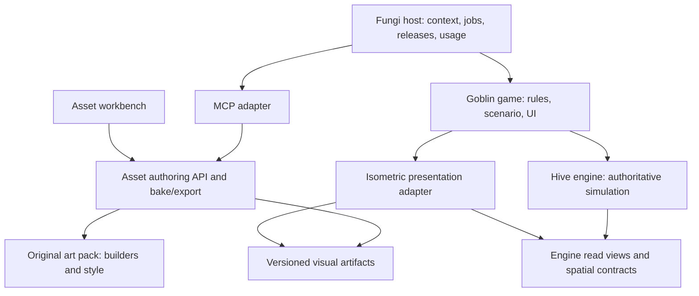

# Hive engine, asset authoring and Goblin Bed & Breakfast

Game CTO decision, 2026-09-09. Accepted product direction from Levi: derive the
reusable engine from the actual sandbox, separate the original asset pipeline,
and make Goblin Bed & Breakfast a game using both. Asset authoring should become
a paid MCP-accessible product; the engine should be usable by others; products
should eventually fit Fungi Apps. This records the boundaries and extraction
order, not a completed SDK, public MCP service or backend deployment.

Source baseline: `2eacfcec8776ea3799264385d86e4ce36749ceb4` plus the preserved,
unpublished needs candidate. The hosted runtime remains `449e9b8`, shallow
Dig/Backfill and schema 14. Astra personally reviewed the current sources and
environmental handoffs; three native readers independently traced engine/game,
art/presentation and actual Botanical App boundaries. None changed runtime.
The [whole-game audit](current-systems-review-and-module-plan.md) supplies the
reproduced defects and Fallow evidence. This decision governs product and module
ownership; the [current sprint](architecture-proof-sprint.md) owns release status.

## Decision: three reusable layers, with a separate platform

**Hive is the world and simulation engine. Goblin Bed & Breakfast is the game
whose rules and content compose that engine. Asset authoring is a toolchain that
can supply both this game and other projects. Fungi supplies product hosting and
commercial authority.** The current repository mixes these concerns; it does
not yet expose them as independent packages.

| Concern | Owns | Does not own |
| --- | --- | --- |
| Hive engine | Versioned terrain generation, edited physical world, topology, navigation, finite materials, claims/transfers, work execution, processes, reusable organism mechanisms, environment updates, snapshot laws | Rowan, mugwort, herbal ale, goblin customer rewards, a particular campaign, menus, accounts or billing |
| Asset pipeline | Validated visual compositions, parameterized builders, render profiles, bake/export, visual anchors/bounds/alpha, caching and disposal | Item quantities, collision permission, recipe results, AI action authority or a running colony |
| Original art packs | Our geometry, palettes/light presets, poses, props, visual variants and authored room dressing, with versions/provenance | Generic rendering machinery or live simulation state |
| Goblin Bed & Breakfast | Starting scenario, species/content definitions, recipes, work and care policies, hospitality, relationships, progression, magic, incidents, UI and mappings from state to art | Copies of carrying, fluid accounting, world generation or the asset baker |
| Fungi platform | App identity/releases, explicit customer or installation authority, eventual hosted execution, entitlements, usage and commercial integrations | A second game clock, material owner or asset geometry fork |

The original art pack is an independently usable output/dependency of asset
authoring, not a fourth simulation. A reusable engine library does not itself
need an account or App installation. A future Hive sandbox/editor can be an App
using that library; Goblin and the asset-authoring product can have their own
App identities. The authoring website and its MCP surface belong to the same
authoring product, rather than separate copies of its state.



Arrows identify dependencies or supplied inputs, not additional mutation owners.
Game policy submits operations to the engine. Presentation reads accepted state.
An LLM uses the game's admitted commands; it never receives direct mutable engine
tables. The engine can run without React, Pixi, Three, Caps, Shiitake or a DOM.

## What exists and what is still being proved

| Area | Actual evidence | Extraction or integration still required |
| --- | --- | --- |
| Small-world simulation | Deterministic browser simulation, actual libcolony assignment, work, construction, materials, brewing, local saves and shallow digging | Separate reusable mechanisms from `Clearing`, content IDs and scattered policy |
| Generated geography | Live `src/world-lab/terrain.js` layered, quantized height/sea generator; bounded overview/local callers and worker | Replace authored terrain only through a compatible base/edit owner; live maps do not prove a resident simulated large world |
| Underground and edits | Isolated cave/feature, sparse edit, eviction/reload and generated-soil experiments; shipped one-voxel dry excavation | Connected excavation, navigation, fields and durable loading using the same geometry |
| Water/soil | Finite transport references and an actual generated wet-soil removal/seepage/restart experiment | Production voxel-scale free water, soil and pail exchange; spill/diversion, backfill displacement and useful gameplay consequences |
| Air/heat | Isolated transport, momentum, energy and opening experiments; public recorded lab playback | A bounded production update over game rooms/openings, explicit fuel/emission/exposure accounting and saved consequences |
| Art | Original Three builders, low-resolution bake, Pixi consumers, numerous studies; kettle Three JSON reload and retained-scene proof | Shared non-Pixi bake/export boundary, normalized builder schemas, pack manifest and public authoring lifecycle |
| Fungi App fit | Checked product ADR and implemented App/Release/anonymous HTML Surface tracer | Real hosted game or render-job join, customer/installation authority and paid service integration |

The wet-pit evidence is approximately 12.6 L entering one pit over 600 simulated
seconds. The gas reference is a declared numerical approximation, not a general
production atmosphere. Public soil/gas/wave playback does not run the solver in
the game. The incomplete full thermal reference stays parked. These are valuable
inputs to an engine implementation, not a claim that the engine already solves
all water, gas, ecology or large-world play.

The current `package.json`, multi-entry Vite build and static `wrangler.jsonc`
deploy a browser application and labs. They do not publish an engine library,
run a multiplayer authority or expose an MCP endpoint.

## Source audit: extract ownership inside the files

Moving `src/` into a directory named `engine` would preserve the coupling. The
following splits name actual consumers and what must leave the shared owner.

| Current source and immediate callers | Engine mechanism to retain/extract | Game or tooling responsibility to separate |
| --- | --- | --- |
| `model.ts`, `clearing.ts`, `actors.ts` | Stable identity, explicit body/navigation/carry/work/organism state; authoritative intervals | `Clearing` remains the Goblin aggregate; initial actors, home roster, supplies and scenario bounds are game definitions |
| `materials.ts` → jobs/activity/persistence | Lot identity, one location, capacity, reservation, split/transfer/consume/produce receipts | Concrete material catalogue and pail/keg definitions; generic transport cannot require a Goblin `Material` union or character name |
| `construction.js:siteMaterialEndpoints`, `finite-sources.ts`, `water-delivery.ts` → jobs/activity/save | Resolved endpoints with capacity, contact, access and lifecycle | Building/source/recipe slot definitions; delete callers that independently reconstruct kettle, tray or shelf containers |
| `jobs.ts`, `activity.ts`, `orders.ts`, `routine.ts` | Supply planning, durable step execution, interruption and terminal settlement; preserve libcolony | Work preferences, personal/shared command policy, care urgency, notices and building/recipe effects |
| `recipes.ts`, `brewing.ts` | Attended work, elapsed processes, reservations and typed material transformations | `RecipeDefinition` currently requires ferment/keg/tap/discard; these are herbal-ale phases, not requirements of every recipe |
| Dirty `needs.ts` → jobs/activity/save/HUD | Need values, elapsed change and receipt-backed restoration | Rates, thresholds, ration effects, automatic-care priority, drafted policy and bed comfort |
| `terrain.ts`, `world.js`, `movement.js` | Physical cells/surfaces, edits, support/contact/traversal queries, invalidation and routing | Authored 15×15 base, current 0/1-storey limit, tree/rock placement and species navigation profiles |
| `src/world-lab/{terrain,worker,main,section}.js` | Versioned sampling/quantization and bounded generator work; later base/edit residency | Diagnostic camera, labels, controls, sample windows and selected geography preset |
| Retained water/soil/gas sources and `src/studies/*` recording callers | Qualify and extract the selected game-scale field update and its state/exchange laws | Reference fixtures, scientific diagnostics and playback UI stay laboratories |
| `persistence.ts` → snapshot/restore/main | Each owner supplies its codec and invariants; composite validation resolves actual references | Supported historical Goblin schemas and scenario grants; browser storage/download/raw recovery adapter. Current readers cover the current schema and 10–14, not every historical version |
| `art/geometry.js`, `art/scale.js`, `art.js:bake` | No simulation ownership; shared metric/projection contracts are inputs | Pipeline math/bake/alpha/disposal, pack light/palette presets, Pixi texture adapter; `scale.js` currently imports game size and terrain |
| `art.js:bakeArt`, `art/*`, brewhouse props/template | Engine reads visual identifiers only | Pack builders versus Goblin ArtBank's exact state/pose enumeration; templates are visual dressing until separately admitted as game construction |
| `terrain-surface-geometry.js` → terrain rendering/picking | Physical surface queries derived from the terrain owner; keep their cache/invalidation beside topology | Projection of those faces and binding a click to a permitted game action |
| `view.js`, `construction-view.js`, `visual-hit-geometry.js` | Query physical geometry; camera math and alpha-span logic are current reusable candidates for an optional iso adapter | Current view lifecycle, entity maps, Goblin target/command bindings, actual art state, cutaway policy and labels; no second generic Pixi view consumer is proved |
| `ui-actions.ts`, `keys.js`, `hud.jsx`, `main.js` | At most reusable interaction/presentation primitives after actual callers prove them | Checked game command catalogue, menus, shortcuts, notices and app composition; Caps stays the public shared UI dependency |

The physical world owns footprints and surfaces. Rendering, picking, routing,
support and permeability ask different questions of them. A sprite's alpha mask
answers whether a visible pixel was clicked; it cannot decide whether a bed is
walkable. Conversely a rectangular physical footprint is not the sprite hitbox.
The optional isometric adapter belongs beside the engine, not inside its physics
kernel. Generic math can accept metric/camera data without importing a game.
Extract a shared view lifecycle or ordering implementation only with its real
consumers and invalidation contract; the existing game view is not already one.

## Capabilities must replace orchestration

The repeated water code is evidence of a missing boundary. Sharing lot storage
did not remove acquisition, contact, target validation, cleanup and phase rules
from `activity.ts`. Several callers still know that a target is a kettle,
mugwort or hydration, and save validation reconstructs those decisions again.

Use separately owned capabilities with stable IDs: a body may support navigation;
a worker may carry and perform supported work; a vessel has a finite interior;
an organism has needs; a site exposes contact surfaces and material endpoints.
The game composes these capabilities. A cat need not become a worker, and a guest
can share physiology without joining the colony. Do not create one universal
entity filled with nullable fields or turn field-grid cells into actor objects.

Capability membership, current eligibility and spatial proximity are different
queries. Derived indexes live at the mutation owner and rebuild after load.
An index result does not bypass permission, capacity, reservations or a route.

An illustrative definition split, not an implemented API:

```ts
// Original art pack: purely visual, independently useful outside Goblin.
const kettleAppearance = {
  id: "hive-art:kettle@1",
  builder: "kettle",
  style: "hive-art:cozy-dark@1",
  parameters: { metal: "copper" },
};

// Game content: validated definitions over supported engine mechanisms.
const kettleDefinition = {
  id: "goblin:kettle@1",
  appearance: kettleAppearance.id,
  capabilities: [
    { kind: "container", key: "liquid", capacity: { litres: 8 } },
    { kind: "work-contact", key: "stir", surface: "front" },
    { kind: "process-host", key: "batch" },
  ],
};

// Construction provides an endpoint; the work owner derives the steps.
const intent = {
  kind: "supply",
  material: "goblin:water@1",
  amount: { litres: 2 },
  destination: { entity: kettleId, capability: "liquid" },
};
work.admit(intent, authority);
// The owner handles reservations, vessel acquisition, travel, draw, travel,
// delivery, interruption and cleanup. Callers do not reset its phase fields.
```

These example litre values illustrate typed units, not a change to current
balance or an already implemented unit conversion. Appearance fields cannot
install capabilities. References, slots, units and the supported capability
union must be validated before a definition is usable.

A water delivery and a herb-establishment effect are not identical operations.
The engine shares acquisition/transport; the plant owner applies establishment,
the material owner receives kettle contents, and the physiology owner restores
hydration. Their cross-owner consumption/effect receipt must commit once or leave
the prior state intact. Retry cannot consume twice or restore needs for free.
Keep these effects typed, exhaustive and owned. An event bus or saved callback
that lets any module patch anything would recreate the problem.

The executor persists actual typed continuation, owner references and results.
Supply planning describes what is required; it does not become a competing item
store. Cancellation releases promises and drops/retains physical goods according
to the same custody rules. Sequence is not freely reorderable when steps share a
vessel, destination or actor. Parallel work needs explicit conflict checks.

Ordinary supported content adds definitions and assets. A new primitive adds a
handler, schema, invariants and cancellation/reload evidence. Initial reuse is
construction wood and shelf storage, then kettle supply and plant watering, with
food/drink as the retained next consumer. The second consumer must delete the old
special path, not retain it behind an adapter. A second supported recipe must not
edit shared transport, persistence or the executor.

## World generation and physical environment are engine capabilities

Keep four distinct owners: **generated base → persistent edits → current physical
fields → derived presentation/query caches**. The generator supplies initial
conditions under a version/seed/metric. It does not refill water, regrow chopped
trees or erase edits when a chunk is loaded again.

Current geometry is 1 m horizontally and 0.54 m vertically; four vertical voxels
equal the 2.16 m storey. Preserve this metric explicitly. A logical storey is not
the vertical voxel coordinate. Broader signed coordinates and navigation must
extend this contract rather than pass `level` directly as Three height.

Layered noise and landform rules produce height; quantization produces solid
terrain; a sea datum informs initial water. Current World Lab initializes all
below-datum surface basins as metadata, not a proved ocean-connectivity or cave-
flooding algorithm. Biomes/materials/caves are versioned generation definitions.
The engine's deterministic sampling and patch semantics are shared; the exact
Goblin geography preset is replaceable data. Globe/minimap sampling consumes the
same geography at a declared footprint without generating every fine tile.

Terrain changes revise exposed faces, support, contact and permeability at one
owner. Navigation and field solvers invalidate the affected derived topology;
rendering updates the affected visuals. Storage chunks are not dams. Simulation
activation and offscreen rendering are separate decisions with explicit boundary
flux/history rules before eviction or coarse simulation is permitted.

For water/air, select a bounded **game-scale** update and reuse retained references
to reject wrong behavior. Begin near one control volume per relevant voxel;
target roughly 5–10 water/air updates per game second with bounded stability work.
Slower soil/thermal updates consume explicit intervals of the same clock. Those
are design targets, not measured browser performance. No millimetre-wave gate or
new high-resolution CFD campaign precedes useful irrigation/ventilation play.

Required engine joins:

- One quantity authority across free water, soil moisture, carried water and
  stored water. Accounted paired exchanges cross owners; rendering owns none.
  Define the current material-unit to physical-volume conversion before joining
  fields to pails. Include wet spoil and displaced water when editing geometry.
- Gas/heat use the same physical openings and volumes. State which quantities
  are canonical and which pressures/operators are derived. Pore-air volume in
  the soil experiment is not already finite oxygen or gas pressure simulation.
- Fuel consumption, emissions, heat and exposure have explicit receipts/rates.
  A bubbling cauldron or smoke sprite does not create heat or pollution.
- Snapshot/restore retains future-affecting state, integrated exchanges and
  pending deterministic work; rebuilding caches cannot change the next result.
- Measure active cells/faces, update/substep cost, allocations, memory and worst
  bursts separately from art/render/assignment. Benchmark the target workload
  before deciding a JS kernel needs Rust/WASM or maintained C. A bulk-array WASM
  boundary is a candidate implementation, not an engine architecture requirement.

The first engine environmental demonstration should become playable: dig a
short diversion into a finite bed/pit, observe retained soil moisture, draw actual
water, close/backfill the route and reload. Air's equivalent is a small fueled
room where changing an opening changes heat/smoke exposure. Neither requires a
larger gameplay map or a complete weather/ecosystem simulation.

## Asset pipeline: a product API beneath tools

Keep one **authoring API → original builders → bake/export** path. The game,
Caps workbench and MCP adapter are consumers. The
[asset-authoring plan](simulation-and-content-contracts.md#proposed-asset-authoring-mcp--2026-09-09)
records the discovery/compose/revise/preview/export loop and checked MCP sources.

Split `art.js:bake` into two stages: capture/outline returns canvas or RGBA plus
alpha metadata without Pixi; the Pixi adapter creates a texture and registers its
hit mask. Export geometry before the currently destructive geometry-disposal
step. Share capture/outline with the brewhouse baker, which currently returns a
canvas but does not emit the game's alpha metadata. Parameterize camera origin/extent;
remove its dependency on `world.SIZE`. Palette, lighting and target scale are
versioned pack profiles. Preserve unchanged accepted pixels through extraction.

Use a visual artifact manifest containing builder/pack/profile versions,
normalized parameters, composition part IDs/transforms, camera/anchor/datum,
image dimensions, visual alpha bounds, clip/facing/frame layout, content hashes
and provenance. Geometry export and pixel export are separate supported outputs.
The kettle trial proves Three r185 Object JSON reload and a retained WebGL scene;
GLB and every character/prop option still require their own implementation.
Standard Three JSON export declares its scene root and calls
`updateMatrixWorld(true)` before serialization, as required by the accepted
kettle trial. JSON does not recover the procedural builder/parameter provenance;
retain that in the manifest.

Collision/support/contact definitions are separately validated semantic content.
A wider content bundle may carry both visual and semantic manifests, but the
game decides which semantic definitions are admitted. A rendered shelf or a
barrel mesh cannot assign its own inventory capacity. Visual attachment markers
can help bind tools to hands without becoming item custody or movement authority.
The engine validates support, contact and traversal against physical cells and
admitted semantic definitions, never against appearance alone.

The current builders have different argument and ownership conventions. Public
schemas must describe supported parameters, not forward an arbitrary object or
execute uploaded JavaScript. Start with original props and small compositions;
modular head/body/clothing authoring waits for the real rig/attachment boundary.
Approved reusable room dressing is distinct from a playable prefab's footprint,
support, access, resources and spawn rules. Placing a village brewhouse must pass
the game/world admission contract.

The runtime baker disposes source geometry. A retained editor instead owns a
live scene until replacement/disposal. Both need explicit geometry, material,
texture, renderer and preview cancellation lifetimes. Export must happen while
the source scene is valid. Service caches key actual normalized inputs and pinned
renderer/profile versions; do not promise cross-GPU byte identity without proof.

MCP exposes this API and returns previews, structured results and artifact links.
Hosted rendering needs a suitable isolated render worker and bounded jobs;
Cloudflare Durable Objects or an MCP listener do not automatically provide a GPU.
Fungi can supply account/entitlement/usage context to the adapter. The pipeline
itself remains usable locally without payment or a platform account.

Charging for hosted generation/workspaces is a product direction, not a current
billing implementation or price. Publish explicit licenses/provenance for the
original packs and code; do not redistribute third-party reference source files.
No license conclusion about those references is inferred from this architecture.
The prior third-party devtools MCP trial remains unenabled because its tested
listener did not provide the required loopback binding; that tool is not a
dependency of our authoring API.

## Persistence, plugins and Fungi Apps

Each engine module owns its state representation and relational laws. Goblin
assembles one consistent snapshot at the authoritative tick, validates cross-
module references and pins semantic definition versions. Browser IndexedDB,
download/recovery and eventual server storage are adapters. Legacy Goblin save
conversions and starter supplies remain game code. Validate the old definition
set before conversion, then validate the new composite state. Unknown required
content is a recoverable compatibility error, not silently replaced defaults.

Plug-like extensibility means explicit module inputs, operations, lifecycle and
results. It does not mean Elixir, arbitrary callbacks in saves, an unrestricted
event bus or loading user code into the trusted host. Closed engine primitive
unions can coexist with versioned namespaced content IDs. Bind trusted extensions
at installation; saved plans reference supported definitions/operations.

Botanical's checked App ADR supports one App with public, dashboard and channel
surfaces. Public customers do not require an invented Team Installation. Actual
`packages/app-release` currently proves opaque App/Release identity and selected,
verified anonymous HTML artifacts. Its README explicitly excludes customer,
Installation/Grant, runtime deployment and hosted instance integration. The Demo
Session host is not a generic game or paid-render installer. Do not advertise the
future App fit as an already joined runtime.

Keep the engine, Goblin and asset tooling in this repository for now with checked
entry boundaries. Package only after real consumers use them; Hive remains a
separate repo. Shared Caps stays in Botanical and is consumed through its public
packed package. Fungi identity, entitlements and host jobs remain Botanical's
authority. A future tool terminal means a tool run finished; it does not prove
that a game command committed, a save became durable or an asset was published.

Checked platform anchors: Botanical
`wiki/3-resources/decisions/adr-app-platform-and-joint-ui-backend-contracts-v1.md`,
`packages/app-release/src/internal/app-release-contract.ts`, its README,
`services/app-publisher/README.md`, and `apps/demo/src/index.ts`. Retained game fit
is `.botanical/research/shiitake-game-platform-fit-20260908.md`; the checked channel
record is `issues/future-platform-plans-v1/06-agent-channels-and-game-events.md` in
Botanical. Hive is the game channel; Discord remains Botanical's responsibility.

## Landing order and acceptance

These are incremental architecture outcomes, not a package rewrite before anyone
can play. Each step preserves the current tiny clearing and old saves or provides
an explicit migration. Sub-agents receive a bounded owner and actual consumers;
Astra retains source acceptance and serial Git/build/proof/deploy custody.

| Order | Concrete outcome | Proof that the boundary exists |
| --- | --- | --- |
| 0. Repair durable facts | Correct partial exact-lot pickup save validation and manual-rest/automatic-thirst coexistence | Positive regression laws show both admitted states snapshot/restore with care intent and split-lot custody preserved; malformed states still reject. The old diagnostic exits 0 when bugs reproduce and is not a passing acceptance test |
| 1. Engine capabilities and work | Extract resolved endpoints/contact and shared supply/execution from current construction/storage/kettle/plant/care callers; separate content definitions | Migrate all consumers of each extracted rule, delete their duplicate cleanup/phase checks; cancellation, partial pickup, blocked destination and paused reload conserve goods; a supported second definition requires no shared executor/save branch |
| 2. Playable care payoff | Publish shared hunger/thirst/rest using that boundary; then one physical inn visitor | Player and visitor share physiology while access, payment and visitor behavior remain game policy; actual food/water receipt causes one benefit |
| 3. Physical world and fields | Shared metric/base/edit/topology contract; bounded finite water/soil and room air/heat joins | Tiny-map diversion and opening changes have saved effects; field/item exchanges balance; active-work cost is measured; no generation-driven refills |
| 4. Asset authoring separation | Common bake/export and original pack descriptors, used by the game and navigable Caps workbench | Same supported composition can be previewed/exported/reloaded without importing `Clearing`; existing game assets retain reviewed scale/alpha/appearance; lifecycle closes |
| 5. Independent distribution | Headless engine entry, pack/pipeline entry, Goblin app entry; MCP adapter over the proved API | A small external consumer uses public exports only; engine imports no Goblin/UI/art/host modules, pipeline imports no live game state; Fungi host integration is separately reviewed |

Step 4 can run independently alongside the coupled engine work once exact art/
adapter files are assigned; it must not compete for `art.js`, `view.js` or shared
geometry during their other writer's checkpoint. Backend publication, new paid
resources and registry changes are not authorized by this document.

Read actual Fallow findings on the extracted files and extend the ordinary test
command to cover their focused laws; current `npm test` covers clearing and
persistence rather than every dedicated materials/needs suite. The full audit's
91 structural findings, 175 clone groups and 233 threshold findings are triage
evidence, not a demand to delete valid studies or upstream code. Complexity in
`Target`, `commandProblem`, `advanceWork`, save binding checks and assignment is
specifically addressed by the ownership splits above.

Success is concrete: a new supported vessel, recipe or worker appearance is
content; its transport, cleanup and reload do not require another copied job
handler. Digging, water and air share the same world. An exported asset can be
used without the Goblin game. Goblin remains the place where we prove those
capabilities make a small world enjoyable.
