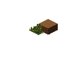
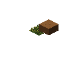

# Hive engine, rendering and Edmund source study — September 20, 2026

Study baseline: `cf9c7854a401cbb245d4b98bf0a32aa2515f81ae`, in the owned
`living-terrain-integration` worktree. This is a source study and proposed repair
sequence, not an engine release. It incorporates Levi's rejection of the Three.js
comparison and his request to study actual games and the accepted creator API.

## Recommendation

Keep the original Three → low-resolution bake → Pixi art pipeline and the current
native simulation. Finish the boundaries between definitions, physical operations,
committed observations and client presentation. The study found a concrete
rendering error, excessive repeated state work, and gaps between declared creator
composition and actual execution. It did not establish that Pixi is unsuitable or
that the whole simulation must be rewritten.

The strongest product direction is a creator tool for small, expressive, shared
worlds: change ordinary TypeScript definitions, see the original art immediately,
and publish the same game pack for people and scoped AI controllers. This is a
recommendation to qualify with existing Colony/Formations consumers, not a claim
that the general creator product is already working. Keep the deliberately small
playable world until measured work supports expansion.

Read the [rendering reassessment](15-renderer-audit-handoff-20260919.md) alongside
this report. Earlier scalar-sort plans and old engine audits are historical
evidence; neither their promises nor their descriptions of missing runtime
features override current source.

## What the comparisons actually show

Repositories were pulled and source was read at the immutable revisions linked
below. No upstream implementation was copied into Hive or added as a dependency.
These comparisons establish mechanisms, not equivalent workloads or speed.

| Source | Mechanism observed | Lesson for Hive; limit of the comparison |
| --- | --- | --- |
| [Scott Steffes's linked sorting demo](https://github.com/markv12/IsoSpriteSortingDemo/blob/86b907c94a42d9cd26fa44973f8bc4d0dc4981ce/Assets/Scripts/IsoSpriteSorting.cs#L175-L243) | Compares a point with an extended line, including which side it lies on. The [manager](https://github.com/markv12/IsoSpriteSortingDemo/blob/86b907c94a42d9cd26fa44973f8bc4d0dc4981ce/Assets/Scripts/IsoSpriteSortingManager.cs#L30-L149) caches static precedence, checks moving overlaps and topologically sorts. | An ordinary long object needs a spatial relation, not its furthest contact converted to a scalar. The demo's 2D model and heuristic cycle handling do not prove arbitrary stacked voxels. YouTube playback was blocked; the evidence is the implementation linked by the video's description. |
| [OpenRCT2 paint preparation](https://github.com/OpenRCT2/OpenRCT2/blob/252987e921fa07587f8192d3a72ac17719938c20/src/openrct2/paint/Paint.cpp#L338-L745) | Spatial buckets and rotation-aware XYZ bounds arrange parent sprites; children and attachments follow explicit draw relationships. | Preserve spatial extent until order is resolved. Use pieces where actual interleaving requires them. This is a constrained terrain/asset system, not proof that every arbitrary voxel image can stay whole. |
| [OpenRCT2 viewport](https://github.com/OpenRCT2/OpenRCT2/blob/252987e921fa07587f8192d3a72ac17719938c20/src/openrct2/interface/Viewport.cpp#L926-L970) | Explicit warning that narrowing sorting candidates to a partial redraw region can change their order. | Culling and retention are correctness contracts too. A pan must not change precedence for unchanged visible geometry. |
| [OpenTTD viewport sorting](https://github.com/OpenTTD/OpenTTD/blob/c56e08d5c35a137cda2e063b05fbf7895d3cf554/src/viewport.cpp#L1598-L1733) | Near-sorted spatial lists, extent comparisons, pruning and a deterministic ambiguous-case fallback. | Avoid all-pairs work. Its [documented sorting defects](https://github.com/OpenTTD/OpenTTD/blob/c56e08d5c35a137cda2e063b05fbf7895d3cf554/known-bugs.md#L59-L79) mean its comparator is not a general correctness oracle. |
| [FreeRCT component grammar](https://github.com/FreeRCT/FreeRCT/blob/eda43627b6dfcd55fa7f9e4fdc72fe9c661a18f7/src/viewport.h#L56-L80), [draw order](https://github.com/FreeRCT/FreeRCT/blob/eda43627b6dfcd55fa7f9e4fdc72fe9c661a18f7/src/viewport.cpp#L209-L214) | Baked sprites, four rotated diagonal traversals, heights and explicit back/front component slots. | A voxel traversal works with an asset contract designed for it. Fixed slots alone cannot order arbitrary unsplit images. Its full-world traversal is not a performance model to import. |
| [OpenRA preparation](https://github.com/OpenRA/OpenRA/blob/f3ec7f8e1593b482f85fd101652deb740c33dee6/OpenRA.Game/GameRules/ActorInfo.cs#L109-L184), [actor creation](https://github.com/OpenRA/OpenRA/blob/f3ec7f8e1593b482f85fd101652deb740c33dee6/OpenRA.Game/Actor.cs#L148-L210) | Validates composition dependencies and actually installs the declared traits, preparing capability arrays for runtime. | Edmund's attachment must cause execution through one preparation owner. C# trait inheritance and per-actor loops are not the proposed implementation. |
| [Luanti registration](https://github.com/luanti-org/luanti/blob/b4eb8b91e611c3d83f7557c39b4f1caab9406e57/builtin/game/register.lua#L118-L145), [timers](https://github.com/luanti-org/luanti/blob/b4eb8b91e611c3d83f7557c39b4f1caab9406e57/src/nodetimer.cpp#L112-L133), [mesh queue](https://github.com/luanti-org/luanti/blob/b4eb8b91e611c3d83f7557c39b4f1caab9406e57/src/client/mesh_generator_thread.cpp#L102-L160) | Checked content registration, ordered due timers, coalesced changed-block mesh work. | Prepare definitions once and charge work to changes/due entries. Its GPU geometry and player-proximity simulation activation are not Hive's rendering or offscreen simulation policy. |

### Why the bed should not be an endless special case

The meaningful question is where an actor is relative to the bed's extent. A
fixed, actor-independent key computed from the bed's contacts cannot preserve
every such relation. Adding several contact points and waiting for the last one
still assigns an intrinsic key before resolving relationships; it does not
implement the video's line comparison. A correctly prepared final draw order
can of course use ordinary scalar indices for the painter.

Current `engine/src/client/voxel-draw-stream.js:147–183,236–269` does precisely
that for ordinary records. It carries useful metadata but does not compare
overlapping extents. Stairs have a separate authored-parts path. The retained
owner compares its result with this same compiler: that proves cache equivalence,
not that either order is geometrically correct.

The supported renderer should combine grid relationships for terrain faces with
spatially pruned precedence relationships for extended sprites, using checked
bake-derived extents and explicit parts only where objects really interleave.
That is an implementation direction requiring an early rendered working shape,
not a claim that an unimplemented comparator is already proven. No bed-name
branch, global sorting bias or cycle suppression qualifies as a general repair.
Ambiguous/cyclic cases need reproducible geometry and an explicit supported asset
contract; do not hide them with an arbitrary tie breaker and declare success.

Starting from 3D models is an advantage. The bake owner can export per-view
anchors, visual bounds, silhouettes and declared render parts with the unchanged
pixels. Physical occupancy/support remains a checked game/native definition;
visual bounds, physical footprint and pixel picking answer different questions.
They must agree on coordinates, scale, rotation and persistent identity without
becoming three competing sources of physical truth.

### A new independent rendered failure

The checked original grass art supplies a small counterexample without furniture.
Mask-13 grass rooted on three low cells is emitted after a nearer raised bank.
The [browser probe](evidence/20260920-grass-bank-render-probe.mjs) uses production
terrain producers, ordering, batching and the original checked atlas. It finds
**24 opaque interior bank pixels incorrectly covered by grass**. Independent ray
geometry establishes that the bank is nearer at those pixels.

| Current order | Bank-last diagnostic |
| --- | --- |
|  |  |

Reversing these few records is a diagnostic only, not the proposed whole-scene
algorithm. The 55 total changed pixels are not all certified by that oracle;
the independently checked wrong count is 24. This does not identify the exact
cause of every diagonal in Levi's screenshot or reproduce his saved world.

Pan/cut/return corruption remains a separate reproduction task. Existing dirty
`cut-terrain-layer.js` and test changes are unaccepted: the test's initial halo
already loaded replacement coverage, so it failed its intended precondition.
They are preserved, not evidence of a successful fix.

Rendering costs also have concrete source leads: a combined revision invalidates
the static stream for water changes; actor insertion changes rebuild merged lists
and terrain runs; changed demand regenerates cover records. See
`voxel-draw-stream-owner.js:69–120`, `cut-terrain-layer.js:194–206`,
`terrain-face-batches.js:60–86` and `client.js:963–984` under `engine/src/client`.
These are not measured GPU bottlenecks. The current compiler sorts contacts;
it is not the old all-pairs graph implementation.

## Performance: current measurements and the work they expose

The new bounded probe uses actual generated WASM, `GameSession` and the existing
productive Colony fixture: 32 workers, 50 finite trees, 90 one-second simulation
steps. All 300 finite wood became 300 ordinary wood in 50 lots. Restoring at step
45 with work underway and replaying the remaining 45 steps produced exactly the
same final snapshot. Final restore/next-step equality also passed.

| Boundary, warm workflow steps 2–85 | Median | p95 |
| --- | ---: | ---: |
| Simulation step | 7.19 ms | 28.80 ms |
| Snapshot capture | 3.41 ms | 4.70 ms |
| Observation construction | 6.91 ms | 9.09 ms |

These are sequential outer boundaries, not frame time. Nested port/native timings
must not be added again. Cold step 1 took 139.36 ms for simulation and 161.08 ms
for observation. Five final idle steps are recorded separately. Maximum held
workers was 32, executing 31, and tree labor observed at step boundaries 19; those maxima need not
occur together. The workload does not keep 32 workers continuously productive.

Node 24.20.0, Linux, two visible EPYC-Milan CPUs; query instrumentation includes
an extra JSON parse to count rows. No Worker transport, Pixi/GPU, SQL/DO or network
is included. A one-second benchmark delta does not predict production 100 ms
tick cost, browser FPS or hosted capacity. [Raw samples and environment](evidence/20260920-engine-cost-result.json),
[probe source](evidence/20260920-engine-cost-probe.ts),
[full source findings](evidence/20260920-engine-cost-findings.md).

The evidence suggests four specific priorities before tuning the pathfinder:

1. **Join observation consumers.** An observation makes 34 native queries;
   lots are queried three times. `observation.ts:49` caches reads but
   `session.ts:1297` supplies visual callbacks another uncached context. One read
   context per committed revision and permitted observation scope should serve
   the real consumers. Sharing work must not mix principals' projections. Native query
   membership is already cached; repeated materialization/JSON remains.
2. **Capture changed state at its owner.** Native rollback staging and accepted
   persistence serialize full state. The entity image is one aggregate JSON blob
   cut into byte chunks, then copied, parsed and diffed in JS. At idle step 86,
   the entire 187,969-byte entity record was marked for rewrite; this is not a
   count of unequal bytes within it. Selective SQL writes are therefore not
   equivalent to incremental capture. Introduce revision-bound dirty records and
   deletion records at the existing mutation/checkpoint owner, preserving rollback
   and receipt/effect atomicity. Retain full checkpoints for recovery.
3. **Maintain accounting where changes occur.** `world.rs:2838` walks every
   entity/schema for accounting. Both the positive tick and construction path
   invoke it, including ticks without construction. Replace repeated recounts
   with owner-maintained deltas, checked against an independent slow calculation.
   This source finding is not a measured percentage of step cost.
4. **Bound discovery, not just results.** Worker cloning, due-task sorting and
   some water/excavation scans happen before truncation. Maintain due/dirty indexes
   at canonical owners and charge visited/rejected candidates. Preserve joint
   matching, continuation and lazy route witnesses. Current assignment is already
   native Rust using `pathfinding::kuhn_munkres_min`; moving it to Rust again is
   not a task.

Existing 200-worker tests use the same 50-tree workload and require some progress.
They do not establish 200 sustained productive actors. Future capacity reports
need completed work, labor/routing/waiting populations and separate native,
capture, observation, rendering, transport and memory measurements.

## Lawfulness: preserve what works, finish the exposed gaps

Current source already has typed native ownership, material reservations,
guarded physical effects, deterministic work and durable Region receipts.
Twenty Region admission/rollback/replay/clock-frontier tests passed freshly in
this study. The DO host already uses alarms, serialized publication and resident
reuse after commit. Historical documents saying these are absent are stale.

This is narrower than proving every Colony law in a deployed process. The new
local work replay is not a DO crash test, and generic Region tests are not a
complete physical-content test suite. No new evidence supports declaring all
simulation laws broken.

| Gap in current source | Required ownership and acceptance |
| --- | --- |
| Ordinary command receipts have a lifetime capacity of 4096. Clock occurrences instead use a durable ordered frontier. | Qualify command longevity with a bounded replay window/retirement protocol that rejects retired replays without reapplying effects. Preserve same-ID replay and conflict behavior. Raising the cap alone does not resolve the lifetime contract. |
| Current GameSession Region execution returns `events: []`; short-lived presentation cues are not durable controller results. | Join admitted work and terminal outcomes to the existing durable result/event boundary. A reconnecting observer must identify completion or failure without inventing state from a visual cue. |
| Mycelium has a real tested Hive integration, but its Goblin consumer uses the older Clearing preset. | Port one actual current Colony intent and scoped durable result through that adapter. Preserve principal checks, request identity and cancellation; do not create another agent framework. |
| Host paths coordinate begin, dispatch, commit, accept/discard and publication. | Encapsulate this lifecycle at the existing authority owner with submit/advance/observe operations. Failure cannot leave a rejected resident available for the next command. |
| Planner code directly cleans up several domain internals. | Move resource/water/excavation transitions behind typed owned operations; the work owner retains attempts and the materials owner retains custody/claims. A split `impl Kernel` file is not by itself a deep boundary. |
| World wake currently follows a deliberate 15-second active lease; offline catch-up was explicitly deferred. | Treat elapsed crop/brew progress as a future capability to qualify, not a bug in the current lease. Rendering visibility must never decide simulation progress. |

Botanical was compared at `5b442a48f35c8ad441a267a87d639efc965a50b5` through
actual source. Watchdog has owner-transaction enqueue/cancel, durable claiming and
claim-token settlement; Mycelium has checked controller registration and scoped
execution. Hive's quarry Watchdog consumer is real, but does not qualify current
Colony integration. Reuse those existing capabilities where demonstrated; a
convenience `waitUntil` reconciliation path alone is not an autonomous wake proof.
See the [durability source findings](evidence/20260920-durability-findings.md).

## Edmund: the API exists, but some promises stop at the definition

The accepted `.with()`, `.where()`, `.do()` direction remains the creator surface.
The actor/behavior builders, checked commands, relations and Buildable compiler
are real. Another DSL would discard progress. The missing work is to make one
definition reliably prepare, execute, render and explain itself through the
existing owners. [Detailed API study](evidence/20260920-edmund-findings.md).

| Author expectation | Actual source and next concrete qualification |
| --- | --- |
| Attach a behavior to an actor and it runs on those instances. | `.behaves()` stores/validates metadata; `GameSession` runs separately registered `pack.systems`. The actual spawned cat and the example composed cat are separate definitions. One pack-preparation owner must install attachments once and compile subject membership. Each eligible instance of two attached actor types runs exactly once per decision; otherwise identical unattached instances do not run. |
| Reads declared by rules become efficient shared decisions. | The phase already caches identical component queries. Per-actor linear searches and terrain fact calls remain; read-declaration enforcement is uneven and `exclusive` checks are local to one behavior run. Prepare useful keyed/batched views and explicit conflict handling; preserve the current deterministic phases. |
| Add a buildable once. | Bed/floor/wall use the compiler, but placement/UI registries and visual naming conventions still need manual coordination. Register one new buildable once and prove build/rotate/select/cancel/rebuild/remove through current native admission and original art. A compiler-object test is insufficient. |
| Add a supported recipe without Rust. | Roles/stages/consumption/output already support this at constructed stations. Qualify another ordinary recipe. A producing tree is still a future capability combination: current process admission requires a finished station and sealed container. |
| Spawn ordinary actors. | The generically named instantiation operation currently creates party/player identities and requires party slots. Earn a non-party creation consumer through the existing atomic owner before advertising general spawning. |
| Bring one pack into a local or hosted runtime. | Injected pack maps exist, but SDK exports, browser entrypoints and host switches still embed demos. One checked pack/build descriptor should feed the existing hosts. It does not require a dynamic plugin service. |

## Deep owners and caller simplification

These are responsibilities to finish in existing modules, not a request to build
five new frameworks or change all package names.

| Existing boundary | Responsibility it should hide | Coordination removed from callers |
| --- | --- | --- |
| Pack preparation | Check definitions/dependencies/versions; install shared behaviors and membership; derive supported catalogs. | Registering the same actor behavior or buildable in several places. |
| Native physical owners | Custody, quantities, claims, attempts and typed domain transitions; maintain their own derived indexes/accounting. | Scheduler knowledge of water/resource/excavation cleanup fields. |
| Session/Region authority | Admission, candidate lifetime, atomic commit, receipt/result, accepted revision and recovery. | Host-specific begin/accept/discard recipes and independent cache resets. |
| Committed observation | One scoped read view per revision, shared projections and eventual measured deltas. | Repeated full queries by visuals, inspection, activities and controllers. |
| Client scene preparation plus original bake owner | Checked art geometry, camera-local ordering, cut visibility, retention, invalidation, shared picking and disposal. | Page-level sorting/batching policy or Pixi deciding world relationships. |

The server owns shared world facts. Each client owns its camera and prepares its
view. Pixi paints the ordered output. Four camera turns do not require server
camera state. Cached observations and display indexes remain rebuildable;
physical state has one authority.

## Proposed delivery sequence with stopping conditions

This refines the current rendering-first queue; it does not authorize a giant
rewrite or make every future creator capability a prerequisite for the Clearing.
Use one writer for each coupled seam and review its first working consumer before
expanding it. Independent observation work can proceed beside rendering; changed
record persistence stays serial with its native/Region acceptance boundary.

1. **Make one original-art room dependable.** Replace the unsupported last-contact
   rule in the real compiler. Prove the grass/bank witness, actors walking around
   the ordinary bed, terrain height changes, stairs, walls and four turns using
   independent expected occlusions. A repaired grass regression must retain
   nonempty certified overlap and both drawables while reducing incorrect
   certified pixels to zero; disappearing geometry is not a pass.
   Reproduce pan/cut/return with genuinely
   incomplete replacement coverage and prove unchanged geometry has unchanged
   order/picking regardless of request history. Keep art pixels. Remove
   superseded sorting policy. Do not expand to another algorithm study before
   this working shape is reviewable in the existing preview.
2. **Remove measured duplicate work.** Join observation contexts first; then make
   accounting and accepted records incremental at their real owners. Re-run the
   pinned finite workload for comparable costs and a separately specified
   sustained workload at production cadence. Report work done and all boundaries,
   including real browser pan/rotation and hosted transaction cost. No arbitrary
   population promise or FPS claim from the Node timings above.
3. **Make ordinary creator edits truthful.** Use the real cat to finish attachment
   preparation and membership. Register one extra buildable and recipe once.
   Change one Formations impact rule through public TypeScript. Delete replaced
   duplicate registries/definitions and show that no supported edit needs Rust
   changes. Measure edit-to-play time and number of files touched.
4. **Qualify shared-world longevity and AI.** Add receipt retirement and durable
   outcome consumption at existing owners; exercise current Colony through
   Mycelium, two independent humans and one scoped AI controller. Reconnect,
   retry, cancel, revoke access and restart the owner during admitted work.
   Exactly one physical effect and an explainable durable result must survive.
   Elapsed offline processes are a separately stated policy/qualification.
5. **Prove the web creator boundary.** Consume one external pack through public
   imports and one descriptor in local/hosted entrypoints. The creator's changes
   should be creature behavior, item/buildable definition, recipe and reaction;
   Hive owns lifecycle, persistence, drawing and permissions. Fast local preview
   and shareable same-pack play are the product test. Preserve the already
   accepted tool witness from packet 15: MCP retained scene document → shared
   bake/export owner → checked raster pack → real bed construction, picking and
   reload. Current editor exports do not yet complete that game-raster path;
   this qualifies visual authoring, not sleeping behavior. Arbitrary untrusted creator
   code hosting is not established by trusted authored TypeScript execution.

No new editor, universal ECS, general workflow language or renderer replacement
is needed to qualify these outcomes. The opportunity becomes credible when these
small creator changes work predictably across the whole existing path.

## Proof receipts and remaining uncertainty

All fresh automated proofs used the shared `run-proof.sh` guard and completed.

| Proof | Receipt | Result and limit |
| --- | --- | --- |
| Actual grass geometry / bank ordering | `u2503`, preserved repeat `u2504` | Geometric counterexample; not a pixel oracle by itself. [Source](evidence/20260920-grass-bank-order-probe.mjs), [result](evidence/20260920-grass-bank-order-probe.json). |
| Original-art browser raster | `u2511`, invocation `c1aaff72428f496db60f159543c2e3d5` | Exit 0, 24 independently checked wrong interior pixels, no browser errors. Earlier top-only `u2508` found no certified interior witness and failed; full-bank proof adds actual visible side faces. [Result](evidence/20260920-grass-bank-render.json). |
| Current native finite work/cost/recovery | `u2510`, invocation `9041e137e61b467dbb39f81b8758af8e` | Exit 0; raw per-step work and costs preserved. Earlier `u2506` queried a deliberately nonqueryable private component and failed; corrected probe inspects captured records. `u2507` first succeeded; `u2510` adds active/idle separation. |
| Region admission and transaction laws | `u2505`, invocation `9460f9b14d624bb495e6bbab415800c0` | 20 tests pass: `src/engine/region/region.test.js` and `admission.test.js`. Generic Region evidence, not a fresh hosted Colony crash suite. |

The WASM artifact was existing generated source, SHA-256
`ce6034ebe6edfeea0fa30f8ae0c1d614627194a256babbdd8a9bed73e07f6106`.
The browser witness was visually inspected. No hosted parity/performance run,
new native build, whole-game capacity qualification or edit-to-preview timing was
performed. [Reproduction instructions](evidence/20260920-study-reproduction.md)
preserve the commands and explain derived statistics. Independent native-cost,
creator and renderer reviews checked the report; their corrections to record
byte counts, attachment membership and pixel acceptance are incorporated.
No product fix or preview deployment is claimed by this study.
